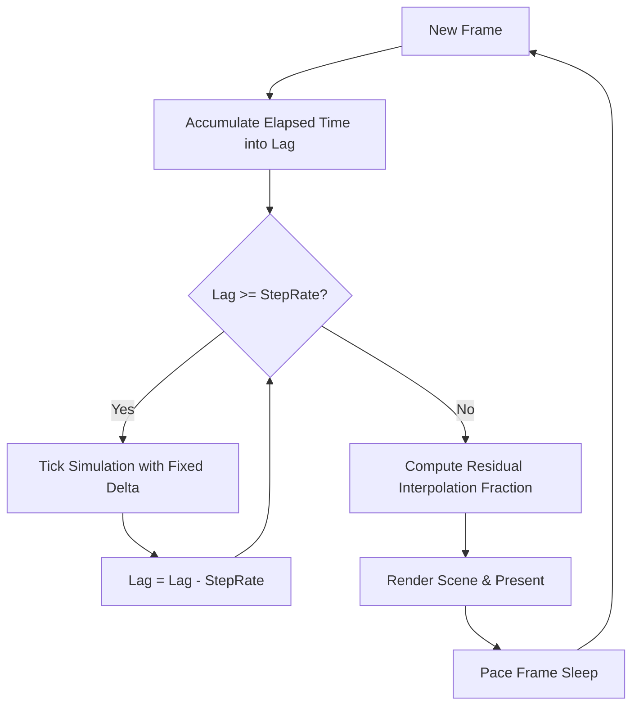

# Architecture

Overview of OpenRCT3's core runtime engine architecture, covering frame timing and game loop synchronization, GPU rendering pipelines, coordinate spaces, and GUI layout paradigms.

## Table of Contents

- [Game Loop & Time-Keeping](#game-loop--time-keeping)
  - [Fixed Simulation Timestep & Variable Rendering](#fixed-simulation-timestep--variable-rendering)
  - [Lag Accumulation & Spiral-of-Death Protection](#lag-accumulation--spiral-of-death-protection)
  - [Interpolation & Visual Smoothness](#interpolation--visual-smoothness)
  - [Frame Pacing & Timer Quantization](#frame-pacing--timer-quantization)
- [GPU & Rendering Architecture](#gpu--rendering-architecture)
  - [Multi-Platform OpenGL via Silk.NET](#multi-platform-opengl-via-silknet)
  - [3D Coordinate System](#3d-coordinate-system)
  - [Model Space Invariant & Rendering Layer Boundaries](#model-space-invariant--rendering-layer-boundaries)
  - [Immediate Mode GUI via Hexa.NET.ImGui](#immediate-mode-gui-via-hexanetimgui)
- [GUI Layout Architecture](#gui-layout-architecture)
  - [Flutter-Inspired Constraints-Down Sizing](#flutter-inspired-constraints-down-sizing)
  - [Stateful vs Stateless Widget Boundaries](#stateful-vs-stateless-widget-boundaries)
- [Diagnostics & Telemetry Conventions](#diagnostics--telemetry-conventions)

---

## Game Loop & Time-Keeping

OpenRCT3 implements the **Fixed Timestep Update with Variable Rendering** pattern, as articulated by Robert Nystrom in [*Game Programming Patterns: Game Loop*](https://gameprogrammingpatterns.com/game-loop.html). This decouples simulation stability from display refresh rates.

### Fixed Simulation Timestep & Variable Rendering

Physics, game simulation, and entity updates require deterministic calculations. Running simulation on variable delta times introduces floating-point integration errors and unstable damping.

The engine separates:
- **Simulation Step Rate (`TargetUpdateRate`)**: A fixed duration (typically 60 Hz = $16.\bar{6}\text{ms}$) passed to deterministic tick handlers.
- **Render Frame Rate (`TargetFrameTime`)**: The interval between consecutive display presents, which adapts dynamically to monitor refresh rates or hardware capabilities.



### Lag Accumulation & Spiral-of-Death Protection

Wall-clock time elapsed since the previous cycle accumulates into a residual duration called `lag`:

$$\text{lag}_{t} = \text{lag}_{t-1} + \Delta t_{\text{wall}}$$

During each loop cycle, the engine consumes fixed increments:

$$\text{ticks} = \lfloor \frac{\text{lag}}{\text{StepRate}} \rfloor$$

If a frame takes unexpectedly long (due to disk I/O, heavy garbage collection, or OS context switches), `lag` spikes. Simulating every missed tick could take longer than the tick itself, creating a fatal feedback loop known as the *spiral of death*.

To protect stability, the engine clamps `lag` to a maximum threshold:

$$\text{lag} \le \text{StepRate} \times \text{MaxSimulationTicks}$$

Excess lag beyond this threshold is dropped, slowing game simulation down gracefully rather than locking up the thread.

### Interpolation & Visual Smoothness

Because rendering happens at arbitrary points between fixed simulation updates, displaying the raw simulation state without smoothing creates visual stutter. The residual lag represents how far the current render moment sits between the previous update and the next:

$$\alpha = \frac{\text{lag}}{\text{StepRate}}, \quad 0.0 \le \alpha < 1.0$$

The renderer uses this interpolation factor $\alpha$ to blend transform states, yielding liquid-smooth rendering even when the simulation runs at 60 Hz and the display runs at 144 Hz or higher.

### Frame Pacing & Timer Quantization

When running with vertical sync (VSync) disabled, the loop regulates frame presentation to match `TargetFrameTime`.

Naïve sleeping via `Thread.Sleep(remaining)` suffers from OS timer quantization on Windows, where the standard timer interrupt resolution is ~15.6ms (or 1.0ms under high-resolution multimedia timers). Fractional sleep hacks (such as dividing remaining time by 2 or 4) produce severe harmonic beat oscillations ("pulses") where alternating frames oversleep and then rush to catch up.

The engine regulates pacing by:
1. Computing remaining presentation headroom: $\Delta t_{\text{remaining}} = \text{TargetFrameTime} - \Delta t_{\text{frame}}$.
2. Sleeping only when headroom exceeds the OS timer resolution threshold (typically $\ge 2\text{ms}$), requesting $\lfloor \Delta t_{\text{remaining}} - 1\text{ms} \rfloor$.
3. Resetting timers upon pause resume to prevent pause intervals from dumping spurious lag spikes into the simulation.

---

## GPU & Rendering Architecture

### Multi-Platform OpenGL via Silk.NET

OpenRCT3 uses [Silk.NET](https://github.com/dotnet/Silk.NET) for high-performance low-level windowing, native input, and modern OpenGL context management:

- **Windows**: Hosted in WinForms via Silk.NET's `WGLSurface` (`net8.0-windows10.0.17763.0`).
- **macOS**: Hosted in native Cocoa `NSOpenGLView` via Silk.NET's `GLSurface`.
- **Linux**: Platform support is in active development in [PR #11: Add Linux platform support](https://github.com/open-rct3/open-rct3/pull/11) using Silk.NET X11/EGL/Wayland bindings.

The renderer is thread-affine (`OpenCobra.GDK.Threading.ThreadAffine`) to guarantee that all OpenGL state alterations, buffer bindings, and draw calls execute strictly on the thread owning the native OpenGL context.

### 3D Coordinate System

OpenRCT3 uses a standard **right-handed 3D coordinate system with Y-up orientation**:
- $+X$: Right / East
- $+Y$: Up (`Vector3.UnitY`)
- $+Z$: Forward / South (towards the camera in default view)

All world geometry, tile elevation, and camera projection calculations adhere to this orientation.

### Model Space Invariant & Rendering Layer Boundaries

Track pieces and all game models only concern themselves with their own model space. Control points, spline samples, and piece geometry are authored, queried, and stored in model coordinates.

World-space transformation is strictly a rendering layer concern. Game entities and pieces do not transform their geometry to world space or store world coordinates. Instead, the rendering pipeline (such as `OpenCobra.GDK.ImDraw` with its transform stack) applies piece model matrices (`Bank`, `Heading`, and `Position`) at draw time.


### Immediate Mode GUI via Hexa.NET.ImGui

In-game tooling, telemetry overlays, and developer diagnostics are rendered using [Hexa.NET.ImGui](https://github.com/HexaEngine/Hexa.NET.ImGui). The GUI pipeline runs on top of the active OpenGL scene, submitting batched vertex and index buffers directly to the GPU at the end of each frame.

---

## GUI Layout Architecture

OpenRCT3's custom GUI primitives (in `OpenCobra.GDK.GUI`) adopt the unidirectional layout model popularized by Flutter: **Constraints go down, sizes go up, parent sets position.**

### Flutter-Inspired Constraints-Down Sizing

Layout sizing operates in whole integer pixels (`Size<int>` and `BoxConstraints`), eliminating sub-pixel boundary blur and seam artifacts:

1. **`BoxConstraints`**: An immutable record struct containing `MinWidth`, `MaxWidth`, `MinHeight`, and `MaxHeight`.
   - `Tight(size)`: Enforces an exact size.
   - `Loose(size)`: Allows any size up to a maximum.
   - `Expand()`: Instructs the child to fill all available parent space.
2. **`IWidget` Interface**:
   ```csharp
   public interface IWidget {
     Size<int> Render(BoxConstraints constraints);
   }
   ```
   Parents pass constraints down. The widget decides its internal dimensions within those bounds, executes its draw operations, and returns its resolved `Size<int>`.

### Stateful vs Stateless Widget Boundaries

- **Stateless Visual Primitives (`Graph.Polyline`)**:
  Pure rendering functions that draw immediate primitives given an explicit parameter payload (`Graph.Plot`). They maintain no state across frames.
- **Stateful Widgets (`RollingPlot`)**:
  Widgets that maintain frame-to-frame continuity. For example, `RollingPlot` manages its own fixed-capacity sample buffer, tracks visible peak ranges, and computes exponential decay smoothing (`currentScale += (targetMax - currentScale) * 0.1f`) so visual transitions remain stable without cluttering parent window code.

---

## Diagnostics & Telemetry Conventions

To preserve clear boundaries and prevent identifier collisions:

- **Framework Diagnostics**: Base Class Library assertion and diagnostic utilities from `System.Diagnostics.Debug` are directly imported via project global usings. Call sites use `Debug.Assert(...)` or `Debug.WriteLine(...)` without prefixing or custom aliases.
- **Game-level Telemetry**: Custom engine metrics, profiling accumulators, and diagnostics facilities residing in `OpenRCT3.Debug` are imported using the alias `Telemetry` (e.g. `using Telemetry = OpenRCT3.Debug;`). This guarantees that framework assertions remain cleanly accessible as `Debug.*` everywhere while clearly identifying runtime telemetry.
